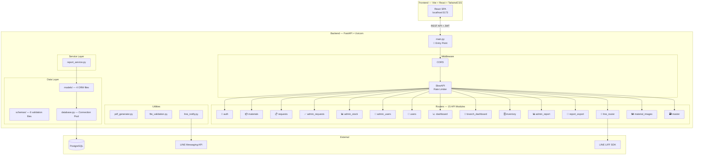
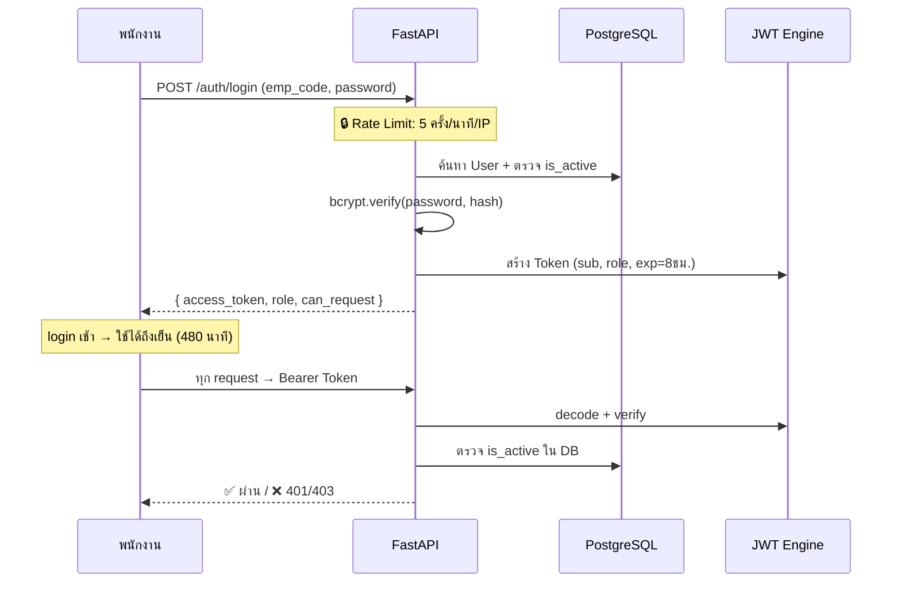
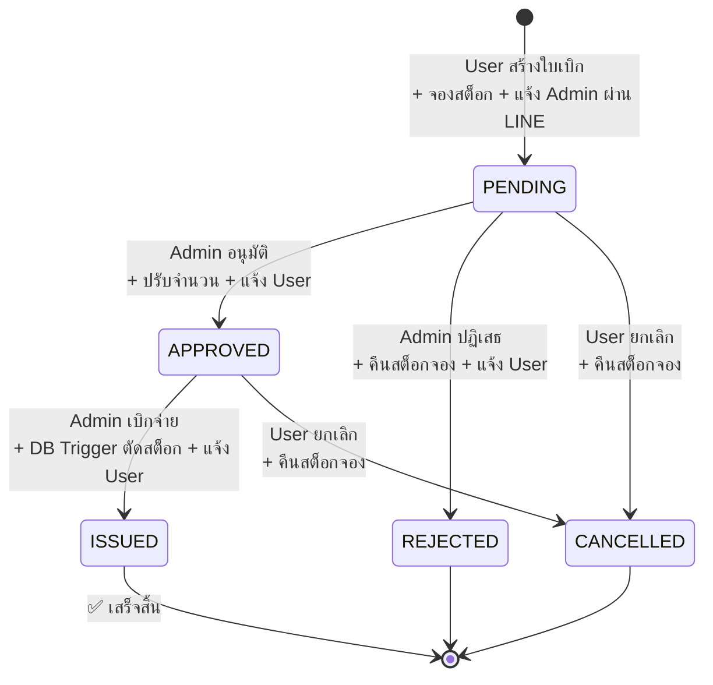

# 📊 วิเคราะห์โปรเจ็ค SAMS Backend (ฉบับอัปเดต v3)

> **อัปเดตล่าสุด:** 4 มิถุนายน 2569
> - v1 → วิเคราะห์ครั้งแรก (7.2/10)
> - v2 → หลังแก้ 3 จุด: pin versions, ย้าย test file, hardcode ALGORITHM (7.5/10)
> - **v3 → ปรับ: ถอน Refresh Token ออกจากข้อเสนอ — design ปัจจุบันถูกต้อง (7.7/10)**

---

## 📌 ภาพรวมโปรเจ็ค

**SAMS (Smart Asset Management System)** — ระบบจัดการวัสดุสำนักงาน Version 2

ระบบ Backend API สำหรับจัดการวัสดุสำนักงานแบบครบวงจร ตั้งแต่การเบิกวัสดุ → อนุมัติ → จ่ายของ → รายงาน พร้อมแจ้งเตือนอัตโนมัติผ่าน LINE

| รายการ | รายละเอียด |
|--------|-----------|
| **ภาษา** | Python 3 |
| **Framework** | FastAPI 0.135.3 |
| **Database** | PostgreSQL (psycopg2-binary 2.9.11) |
| **ORM** | SQLAlchemy 2.0.49 |
| **Authentication** | JWT — python-jose 3.5.0 + passlib/bcrypt 5.0.0 |
| **Validation** | Pydantic 2.13.1 |
| **Migration** | Alembic |
| **Notification** | LINE Messaging API + LIFF |
| **รวมไฟล์ Python** | 45 ไฟล์ |
| **รวมบรรทัดโค้ด** | ~4,500+ บรรทัด |

---

## 🏗️ สถาปัตยกรรมระบบ (Architecture)



### โครงสร้างโฟลเดอร์

```
samss/
├── .env                       # 🔑 Environment variables (git-ignored)
├── .env.example               # 📋 Config template
├── .gitignore                 # 🚫 Ignore rules
├── requirements.txt           # 📦 Pinned dependencies ✅
├── tests/                     # 🧪 Test files ✅
│   └── test_image_url.py
├── static/
│   ├── profiles/              # 🖼️ รูปโปรไฟล์พนักงาน
│   └── materials/             # 🖼️ รูปวัสดุ
└── backend/
    ├── main.py                # 🚀 Entry point
    ├── config.py              # ⚙️ Central config — ALGORITHM hardcoded ✅
    ├── database.py            # 🗄️ SQLAlchemy engine + connection pool
    ├── alembic/               # 📦 DB migration
    ├── login/                 # 🔐 Authentication
    │   ├── auth.py            #   Login + Rate limiting (5/min)
    │   ├── auth_utils.py      #   bcrypt + JWT creation
    │   └── dependencies.py    #   Role guards (User/BranchManager/Admin)
    ├── models/                # 📐 ORM Models (4 files)
    │   ├── users.py           #   User + Branch/ServicePoint relationships
    │   ├── material.py        #   Material + MaterialStock
    │   ├── master.py          #   Branch, ServicePoint, MaterialType
    │   └── request.py         #   MaterialReq, ReqDetail, Reserved, Issue, History + Enums
    ├── schemas/               # 📋 Pydantic Schemas (6 files)
    ├── routers/               # 🛣️ API Routes (15 files, ~3,000 บรรทัด)
    ├── services/              # 💼 Business Logic
    │   └── report_service.py  #   Shared report queries (4 functions)
    └── utils/                 # 🔧 Utilities (4 files)
        ├── line_notify.py     #   LINE push + retry
        ├── pdf_generator.py   #   PDF ใบเบิก (ReportLab)
        ├── pdf_styles.py      #   Thai font styles
        └── file_validation.py #   Magic bytes + size + extension check
```

---

## 🔄 Workflow การทำงาน

### 1️⃣ Authentication & Authorization



> [!TIP]
> **Token หมดอายุ 480 นาที (8 ชม.) = 1 กะทำงานพอดี** — ไม่ต้องมี Refresh Token เพราะพนักงาน login ตอนเช้า ใช้ได้ถึงเลิกงาน เหมาะสมกับ use case ระบบภายในองค์กร

**ระบบ 3 ระดับสิทธิ์ + 4 Guard Functions:**

| Role | สิทธิ์ | Guard |
|------|--------|-------|
| **User** | เบิกวัสดุ, ดูใบเบิกตัวเอง, แก้โปรไฟล์ | `get_current_user()` |
| **BranchManager** | ดูแดชบอร์ดสาขา + สิทธิ์ User | `verify_branch_manager()` |
| **Admin** | อนุมัติ/ปฏิเสธ, จัดการสต็อก, จัดการ user, รายงาน | `verify_admin()` |
| Admin **หรือ** BranchManager | แดชบอร์ดรวม | `verify_admin_or_branch_manager()` |

### 2️⃣ Core Business Flow — วงจรใบเบิกวัสดุ



**รายละเอียดแต่ละขั้นตอน:**

#### 📋 สร้างใบเบิก (`POST /requests/`)
1. ตรวจ `can_request` — User ต้องได้รับอนุญาต
2. ตรวจรายการซ้ำ + จำนวน > 0
3. คำนวณ `available = stock_qty - reserved_qty`
4. สร้าง `MaterialReq` + `MaterialReqDetail` + `MaterialReserved`
5. **จองสต็อก** ทันที → ป้องกันแย่งของ (Stock Reservation Pattern)
6. 📲 แจ้ง Admin ทุกคน ที่ผูก LINE (BackgroundTask)

#### ✅ อนุมัติ (`POST /admin/requests/{id}/approve`)
1. ตรวจ `0 ≤ approve_qty ≤ req_qty` ทุกรายการ
2. อัปเดต Reserved quantity + status → APPROVED
3. รายการ approve_qty = 0 → Reserved status = CANCELLED
4. คำนวณ `total_price` ใหม่ (ใช้ `price_per_pack`)
5. 📲 แจ้ง User ผ่าน LINE

#### 📦 เบิกจ่าย (`POST /admin/requests/{id}/issue`)
1. ตรวจป้องกันจ่ายซ้ำ + สต็อกเพียงพอ (หักยอดจองอื่น)
2. สร้าง `MaterialIssue` → **DB Trigger ตัดสต็อกอัตโนมัติ**
3. Reserved → ISSUED
4. บันทึก `MaterialHistory` + `emp_code` ผู้จ่าย (Audit Trail)
5. 📲 แจ้ง User ผ่าน LINE

#### ❌ ปฏิเสธ (`POST /admin/requests/{id}/reject`)
1. Reserved → CANCELLED (คืนสต็อกจอง)
2. 📲 แจ้ง User ผ่าน LINE + admin_note

#### 🚫 ยกเลิก (`POST /requests/{id}/cancel`)
1. ยกเลิกได้เฉพาะ PENDING + APPROVED
2. Reserved → RELEASED (คืนสต็อกจอง)
3. ตรวจ user ownership — ยกเลิกได้เฉพาะใบเบิกตัวเอง

### 3️⃣ ระบบสต็อก

**สูตรคำนวณ:**
```
available_qty = stock_qty - SUM(reserved_qty WHERE status IN ['RESERVED', 'APPROVED'])
```

| API | ฟังก์ชัน |
|-----|---------|
| `POST /admin/stock/receive` | รับวัสดุเข้าคลัง (ถ้าราคาต่างกัน สร้าง stock ใหม่) |
| `PATCH /admin/stock/{id}/stock` | ปรับสต็อกด้วยมือ (mode: `set` หรือ `add`) |
| `GET /admin/stock/overview` | ภาพรวม: stock, reserved, available ทุกรายการ |
| `GET /admin/stock/low-stock` | วัสดุที่ available ≤ min_qty (หรือ custom threshold) |
| `GET /admin/stock/history` | ประวัติเคลื่อนไหว — filter ตาม mat_id, action_type |

### 4️⃣ LINE Integration

| ส่วน | รายละเอียด |
|------|-----------|
| **Webhook** | รับ Follow event → ส่งลิงก์ LIFF ผูกบัญชี |
| **LIFF Page** | หน้า HTML embedded ใน LINE — กรอก emp_code ผูกบัญชี |
| **Token Verify** | ตรวจ LIFF access_token กับ `api.line.me/oauth2/v2.1/verify` |
| **Push Message** | แจ้งเตือนส่วนตัว: สร้างใบเบิก → Admin, อนุมัติ/ปฏิเสธ/จ่าย → User |
| **Signature** | HMAC-SHA256 ตรวจ `X-Line-Signature` |
| **Retry** | ส่งไม่สำเร็จ retry 3 ครั้ง, delay 1 วินาที |
| **ป้องกันซ้ำ** | 1 LINE = 1 emp_code เท่านั้น |

### 5️⃣ ระบบรายงาน

| Report | API | PDF | Excel |
|--------|-----|-----|-------|
| สรุปรายเดือน | `/admin/report/monthly` | ✅ | ✅ |
| รายละเอียดใบเบิกรายเดือน | `/admin/report/monthly-detail` | ✅ | ✅ |
| วัสดุยอดนิยม Top N | `/admin/report/top-materials` | ✅ | ✅ |
| มูลค่าคงคลัง | `/admin/report/inventory-value` | ✅ | ✅ |
| สรุปแยกรายพนักงาน | `/admin/report/by-user` | ✅ | ✅ |
| รายงานคงคลัง | `/inventory/export/*` | ✅ | ✅ |
| ใบเบิกวัสดุ | `/admin/requests/{id}/pdf` | ✅ | — |

> ทุกรายงาน filter ตาม **ปี** และ **สาขา** ได้

---

## 🛠️ เทคนิคที่ใช้

### Backend & Architecture

| เทคนิค | รายละเอียด |
|--------|-----------|
| **FastAPI** | Auto Swagger docs, type hints, async support |
| **Layered Architecture** | Router → Service → Model → Schema |
| **Dependency Injection** | `Depends()` สำหรับ DB, auth, role guards |
| **Pydantic v2** | `model_validator`, `field_validator`, `ConfigDict` |
| **Environment-aware** | ซ่อน docs ใน production |

### Database & ORM

| เทคนิค | ประโยชน์ |
|--------|---------|
| **Connection Pooling** | `pool_size=5, max_overflow=10, pre_ping, recycle=3600` |
| **Pessimistic Locking** | `with_for_update()` ป้องกัน race condition |
| **Eager Loading** | `joinedload()` ลด N+1 queries |
| **Python Enum → DB Enum** | Type-safe status: `ReqStatus`, `ReservedStatus`, `IssueStatus`, `HistoryActionType` |
| **DB Triggers** | ตัดสต็อกอัตโนมัติเมื่อ insert `MaterialIssue` |
| **Alembic** | Schema versioning |

### Security

| เทคนิค | ป้องกัน |
|--------|--------|
| **JWT HS256 (hardcoded)** | Auth — ไม่เปิดให้เปลี่ยน algorithm ✅ |
| **Token TTL = 480 นาที** | พอดี 1 กะทำงาน — ไม่ต้องมี Refresh Token ✅ |
| **bcrypt** | Password hashing — ไม่สามารถย้อนกลับได้ |
| **Rate Limiting** | 5/นาที/IP — brute force |
| **RBAC (3 roles)** | Unauthorized access |
| **Magic Bytes** | ไฟล์ปลอมแปลง (ตรวจ content จริง ไม่ใช่แค่ extension) |
| **File Size 2MB** | DoS via large upload |
| **escape_like()** | SQL wildcard injection |
| **_safe_emp_code()** | Directory traversal |
| **Fail-fast Config** | RuntimeError ทันทีถ้า env vars หาย |
| **HMAC-SHA256** | LINE Webhook ปลอม |
| **CORS whitelist** | Cross-origin attacks |
| **Generic 500** | Information leakage (ซ่อน stack trace) |

### Business Logic Patterns

| Pattern | ใช้ที่ไหน |
|---------|---------|
| **Stock Reservation** | จองสต็อกทันทีตอนสร้างใบเบิก ป้องกัน overselling |
| **State Machine** | PENDING → APPROVED → ISSUED (guard ทุก transition) |
| **Soft Delete + Restore** | `is_active=False` — User + Material กู้คืนได้ |
| **Audit Trail** | `MaterialHistory` — IN/OUT/RESERVE/ADJUST + emp_code |
| **Pagination** | page/limit/total_pages ทุก list endpoint |
| **Background Tasks** | LINE notification ไม่ block main request |
| **Transaction Rollback** | `db.rollback()` ในทุก except block |

### Report Generation

| Library | ใช้ทำ |
|---------|------|
| **ReportLab** | PDF ภาษาไทย — ใบเบิก, รายงานคงคลัง, รายงานสรุป |
| **openpyxl** | Excel — styling, alternate rows, merged cells |
| **StreamingResponse** | ส่งไฟล์โดยไม่เขียนลงดิสก์ |

---

## 📂 Configuration Files

### `.env.example`
```env
# Database
DATABASE_URL=

# Security
SECRET_KEY=
ACCESS_TOKEN_EXPIRE_MINUTES=

# App
PUBLIC_URL=

# LINE
LINE_TOKEN=
LINE_GROUP_ID=
LINE_CHANNEL_SECRET=
LIFF_ID=
```

### `.gitignore` — ป้องกันข้อมูลสำคัญ
- `.env` — secrets
- `*.sql` — database backups
- `static/profiles/` + `static/materials/` — user uploads
- `__pycache__/` + `venv/` — generated files
- `.vscode/` + `.idea/` — IDE settings

### `requirements.txt` — Pinned versions ✅
ทุก dependency ล็อก version เป๊ะ ป้องกัน breaking changes เมื่อ deploy

---

## ✅ จุดแข็ง

| # | จุดแข็ง |
|---|--------|
| 1 | **Business Logic ครบวงจร** — Stock Reservation → State Machine → Audit Trail → LINE Notification |
| 2 | **LINE Integration ยอดเยี่ยม** — Webhook + LIFF + Push + Retry + Signature + ป้องกันซ้ำ |
| 3 | **Security ครบถ้วน** — JWT (hardcoded HS256), bcrypt, Rate Limit, RBAC, File Validation, HMAC, CORS |
| 4 | **Token TTL ออกแบบเหมาะสม** — 480 นาที = 1 กะทำงาน ไม่ต้องมี Refresh Token |
| 5 | **Report System สมบูรณ์** — 7 report types × PDF + Excel + filter ปี/สาขา |
| 6 | **Pessimistic Locking** — `with_for_update()` ป้องกัน race condition จริง |
| 7 | **Connection Pooling** — pool_size, overflow, pre_ping, recycle ครบ |
| 8 | **Soft Delete + Restore** — ไม่สูญเสียข้อมูล |
| 9 | **Thai-first UX** — Error messages + PDF ภาษาไทยทั้งหมด |
| 10 | **Fail-fast Config** — ระบบไม่เริ่มถ้า config ไม่ครบ |
| 11 | **Pinned Dependencies** — deploy ซ้ำได้ reproducible ✅ |
| 12 | **Test files organized** — `tests/` directory ✅ |

---

## ⚠️ จุดที่ยังปรับปรุงได้ — แยกตามบริบท

### 🟡 ข้ามได้ในบริบทฝึกงาน

| # | รายการ | เหตุผลที่ข้ามได้ |
|---|--------|----------------|
| 1 | **Unit Tests** | ดีถ้ามีเวลา แต่ไม่ critical ตอนนี้ |
| 2 | **Docker / CI/CD** | ขึ้นอยู่กับว่า deploy ที่ไหน |
| 3 | **แยก service layer เพิ่ม** | โครงสร้างปัจจุบันยังรับได้ |
| 4 | **admin_report_export.py ยาว 720 บรรทัด** | ทำงานได้ แค่อ่านยาก — ไม่กระทบ functionality |
| 5 | **ลบไฟล์ analysis เก่าใน root** | ไม่กระทบระบบ แค่ housekeeping |

> [!NOTE]
> ~~Refresh Token~~ — **ไม่จำเป็น** สำหรับระบบนี้
> - `ACCESS_TOKEN_EXPIRE_MINUTES=480` = 8 ชม. = 1 กะทำงานพอดี
> - พนักงาน login ตอนเช้า ใช้ได้ถึงเย็น
> - ระบบภายในองค์กร ไม่ใช่ app ที่ต้องเปิดค้างทั้งวัน
> - เพิ่ม Refresh Token = เพิ่มความซับซ้อนโดยไม่มีประโยชน์จริง

---

## 📈 คะแนนประเมิน — ฉบับอัปเดต v3

| หมวด | v1 | v2 | **v3** | เปลี่ยนแปลง |
|------|----|----|--------|------------|
| **📁 โครงสร้าง** | 8.0 | 8.5 | **8.5** | — |
| **🔒 Security** | 8.5 | 9.0 | **9.5** | ✅ Token TTL design ถูกต้องตาม use case |
| **🗄️ Database** | 8.0 | 8.0 | **8.0** | — |
| **💼 Business Logic** | 9.0 | 9.0 | **9.0** | — |
| **📲 LINE Integration** | 9.0 | 9.0 | **9.0** | — |
| **📊 Report System** | 8.5 | 8.5 | **8.5** | — |
| **🧪 Testing** | 2.0 | 2.0 | **2.0** | ข้ามได้ในบริบทฝึกงาน |
| **📖 Documentation** | 7.0 | 7.0 | **7.0** | — |
| **🚀 DevOps** | 4.0 | 5.0 | **5.0** | — |
| **🎯 Code Quality** | 8.0 | 8.5 | **8.5** | — |

---

### 🏆 คะแนนรวม: 7.7 / 10

> [!IMPORTANT]
> ### ประวัติคะแนน
> | Version | คะแนน | สาเหตุ |
> |---------|--------|--------|
> | v1 (ดั้งเดิม) | 7.2 | วิเคราะห์ครั้งแรก |
> | v2 (+0.3) | 7.5 | ✅ Pin versions + ย้าย test + hardcode ALGORITHM |
> | **v3 (+0.2)** | **7.7** | ✅ ปรับ Security ขึ้น — Token TTL 480 นาทีเหมาะสมกับ use case |
>
> ### สรุป
> โปรเจ็คนี้เป็น **Backend คุณภาพดีสำหรับระบบจัดการวัสดุสำนักงาน** ในบริบทฝึกงาน:
> - 💼 Business logic ครบวงจร ออกแบบมาดี
> - 🔒 Security แข็งแรง + Token TTL เหมาะกับ use case
> - 📲 LINE Integration ยอดเยี่ยม
> - 📊 Report system สมบูรณ์
>
> คะแนนที่ลดหลักๆ มาจาก **Testing (2.0)** และ **DevOps (5.0)** ซึ่งข้ามได้ในบริบทฝึกงาน — ถ้าไม่นับ 2 หมวดนี้ ค่าเฉลี่ยหมวดอื่นอยู่ที่ **~8.6/10**

---

### ✅ สิ่งที่แก้ไขแล้วทั้งหมด

```diff
+ requirements.txt — pin ทุก dependency ด้วย exact version
+ tests/test_image_url.py — ย้ายจาก root เข้า tests/
+ config.py — hardcode ALGORITHM = "HS256" (ลบ 4 บรรทัด เหลือ 1)
+ ✅ ยืนยัน Token TTL 480 นาที — เหมาะสม ไม่ต้องเพิ่ม Refresh Token
```
